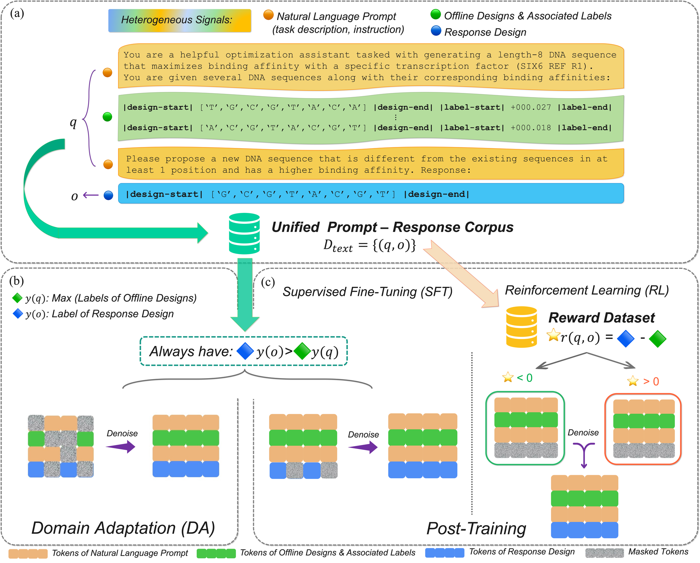
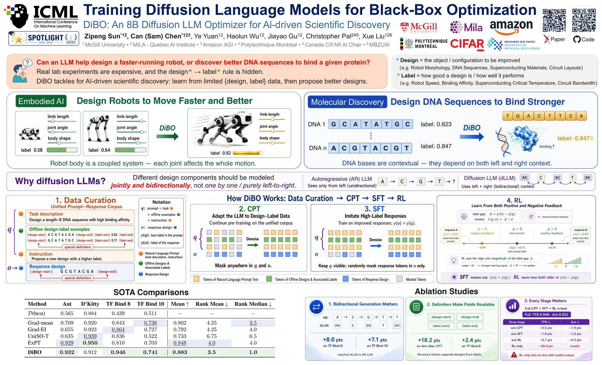

# Training Diffusion Language Models for Black-Box Optimization

<p align="center">
  <a href="https://arxiv.org/abs/2603.17919"></a>
  <a href="https://openreview.net/forum?id=Z7wI0sor6i"></a>
  <a href="https://icml.cc/virtual/2026/poster/63202"></a>
  <a href="https://huggingface.co/zpointsun/DiBO-TFBind8"></a>
  <a href="#license"></a>
</p>
<p align="center">
  <a href="assets/dibo-paper.pdf"><b>Paper</b></a> |
  <a href="#poster"><b>Poster</b></a> |
  <a href="#training"><b>Training</b></a> |
  <a href="#evaluation"><b>Evaluation</b></a> |
  <a href="#data-and-preprocessing"><b>Data</b></a>
</p>

Official implementation of **Training Diffusion Language Models for Black-Box
Optimization**, an ICML 2026 Spotlight paper.

Offline black-box optimization seeks improved designs using only a fixed
dataset of designs and labels. DiBO adapts a diffusion language model to this
setting so that bidirectional masked modeling can capture dependencies that
left-to-right generation may miss. It represents natural-language
instructions, designs, and labels in a unified prompt-response corpus, marks
their semantic roles with special delimiter tokens, and trains through domain
adaptation (DA), supervised fine-tuning (SFT), and reinforcement learning
(RL).

<p align="center">
  <a href="assets/dibo-paper.pdf">
    
  </a>
</p>
<p align="center">
  <sub>DiBO overview. Click the figure for the vector PDF; the
  <a href="assets/dibo-overview-full.png">full-resolution PNG</a> is also available.</sub>
</p>

## News

- **August 2026:** All DiBO code and artifacts are now publicly available on
  [GitHub](https://github.com/zpointS/DiBO) and
  [Hugging Face](https://huggingface.co/papers/2603.17919).
- **July 2026:** Presented at ICML 2026. Thank you to everyone who attended
  and to our colleagues for their support.
- **May 2026:** Accepted to ICML 2026 as a Spotlight paper.

## Method

DiBO extends the tokenizer with four special delimiter tokens:

```text
|design-start|  |design-end|  |label-start|  |label-end|
```

These tokens identify designs and labels within the unified prompt-response
corpus. Training then proceeds in three stages:

1. **Domain adaptation (DA)** jointly reconstructs masked prompt and response
   tokens to adapt the diffusion language model to heterogeneous BBO signals.
2. **Supervised fine-tuning (SFT)** predicts masked response tokens and learns
   to propose designs that improve on the examples in the prompt.
3. **Reinforcement learning (RL)** uses label improvement from prompt to
   response as the reward and a one-step log-probability approximation for the
   RL objective.

## Tasks

DiBO supports the four main Design-Bench tasks used in the paper:

| Task | Type | Dimension |
|---|---|---:|
| `TFBind8-Exact-v0` | discrete DNA sequence | 8 |
| `TFBind10-Exact-v0` | discrete DNA sequence | 10 |
| `AntMorphology-Exact-v0` | continuous morphology | 60 |
| `DKittyMorphology-Exact-v0` | continuous morphology | 56 |

For TFBind10, the source measurements are binding free-energy differences
(`ddG`), where lower values indicate stronger binding
([Le et al., 2018](https://doi.org/10.1073/pnas.1715888115)). DiBO represents
the objective as `score = -ddG`, making larger values consistently better
across all four maximization tasks. The repository includes a canonical
exhaustive TFBind10 lookup in this higher-is-better direction.

## Installation

Python 3.10, a BF16-capable NVIDIA GPU, and a driver compatible with CUDA 11.8
are required. The experiments used NVIDIA H100 GPUs. Create a standard virtual
environment and install the pinned dependencies:

```bash
git clone https://github.com/zpointS/DiBO.git
cd DiBO

python3.10 -m pip install --user "virtualenv==20.13.0"
python3.10 -m virtualenv .venv
source .venv/bin/activate

python -m pip install --upgrade \
  "pip==24.0" \
  "setuptools==65.5.1" \
  "wheel==0.38.4"
python -m pip install \
  --index-url https://download.pytorch.org/whl/cu118 \
  "torch==2.6.0+cu118"
python -m pip install -r requirements.txt
python -m pip check
```

Training reads the included task bundles instead of initializing Design-Bench
for every run. These model-ready caches preserve the filtering, score alignment,
sorting, and normalization needed by the training pipeline, which avoids
repeating the slower benchmark loading and preprocessing steps. The
Design-Bench data cache used for the released experiments is not required for
training.

TFBind10 evaluation uses the included exhaustive lookup. TFBind8, Ant, and
D'Kitty evaluation additionally require the Design-Bench oracle dependencies
and data cache; the morphology tasks also require MuJoCo 2.0. Follow
[`docs/installation.md`](docs/installation.md) for the oracle environment and
[Data and Preprocessing](#data-and-preprocessing) for the data-cache
installation.

## Checkpoints

Four task-specific final models, each produced by the DA, SFT, and RL stages,
are available on Hugging Face:

| Task | Model repository | Release |
|---|---|---|
| `TFBind8-Exact-v0` | [DiBO-TFBind8](https://huggingface.co/zpointsun/DiBO-TFBind8) | [`v1.1.4`](https://huggingface.co/zpointsun/DiBO-TFBind8/tree/v1.1.4) |
| `TFBind10-Exact-v0` | [DiBO-TFBind10](https://huggingface.co/zpointsun/DiBO-TFBind10) | [`v1.1.4`](https://huggingface.co/zpointsun/DiBO-TFBind10/tree/v1.1.4) |
| `AntMorphology-Exact-v0` | [DiBO-AntMorphology](https://huggingface.co/zpointsun/DiBO-AntMorphology) | [`v1.0.4`](https://huggingface.co/zpointsun/DiBO-AntMorphology/tree/v1.0.4) |
| `DKittyMorphology-Exact-v0` | [DiBO-DKittyMorphology](https://huggingface.co/zpointsun/DiBO-DKittyMorphology) | [`v1.0.4`](https://huggingface.co/zpointsun/DiBO-DKittyMorphology/tree/v1.0.4) |

Each repository provides the same final task-specific model in two formats:

1. The original task-specific `.pt` file is the canonical paper-faithful
   training artifact. It stores the model state dictionary under `model` and
   loads on top of the pinned LLaDA base revision below.
2. The root-level config, tokenizer, custom model code, and safetensors shards
   are a validated convenience export. Load them directly with
   `AutoModel.from_pretrained(..., trust_remote_code=True)`.

The safetensors export was derived from the original `.pt`, not trained
separately. The base weights are not duplicated in the DiBO model repositories.
The original checkpoint path uses:

```text
GSAI-ML/LLaDA-8B-Instruct
revision 08b83a6feb34df1a6011b80c3c00c7563e963b07
```

The exact Design-Bench data snapshot used for the DiBO experiments is available
separately as
[DiBO-DesignBench-Snapshot](https://huggingface.co/datasets/zpointsun/DiBO-DesignBench-Snapshot).

## Training

`scripts/run_pipeline.sh` runs DA, SFT, and RL sequentially and writes
checkpoints under `outputs/checkpoints` by default. For a discrete task:

```bash
DIBO_SEED=<SEED> bash scripts/run_pipeline.sh TFBind8-Exact-v0
```

For a continuous task:

```bash
DIBO_SEED=<SEED> bash scripts/run_pipeline.sh AntMorphology-Exact-v0
```

Set `MODEL_NAME_OR_PATH` to a local LLaDA snapshot when training without
network access, and set `DIBO_OUTPUT_DIR` to change the output directory.

To change the paper preset for an experimental run, invoke `main.py` directly.
For example, this shortens every stage and changes the three learning rates for
TFBind8:

```bash
python main.py \
  --use TFBind8-Exact-v0 \
  --stages da sft rl \
  --seed <SEED> \
  --da_lr 1e-5 \
  --sft_lr 1e-5 \
  --rl_lr 5e-7 \
  --da_steps 512 \
  --sft_steps 512 \
  --rl_steps 64 \
  --output_dir outputs/tfbind8-custom \
  --wandb_mode offline
```

Command-line values override `configs/train.yaml`.

## Evaluation

Each candidate is produced from one fully masked response with one model
forward followed by argmax extraction. To evaluate the standard Transformers
export directly:

```bash
python eval.py \
  --tasks TFBind8-Exact-v0 \
  --model_name_or_path zpointsun/DiBO-TFBind8 \
  --model_revision v1.1.4 \
  --seeds <SEEDS> \
  --num_candidates 128 \
  --max_attempts 1000 \
  --save_details \
  --output_json outputs/eval/tfbind8.json
```

For the canonical original checkpoint, download one named file and use the
existing `--checkpoint_path` interface:

```bash
hf download zpointsun/DiBO-TFBind8 dibo_tfbind8_final.pt \
  --revision v1.1.4 --local-dir checkpoints/dibo-tfbind8
```

```bash
python eval.py \
  --tasks TFBind8-Exact-v0 \
  --checkpoint_path checkpoints/dibo-tfbind8/dibo_tfbind8_final.pt \
  --seeds <SEEDS> \
  --num_candidates 128 \
  --max_attempts 1000 \
  --save_details \
  --output_json outputs/eval/tfbind8.json
```

For Ant, install the oracle environment first and use the same interface:

```bash
python eval.py \
  --tasks AntMorphology-Exact-v0 \
  --model_name_or_path zpointsun/DiBO-AntMorphology \
  --model_revision v1.0.4 \
  --seeds <SEEDS> \
  --num_candidates 128 \
  --max_attempts 1000 \
  --save_details \
  --output_json outputs/eval/ant.json
```

`--seeds` accepts one or more space-separated values. The command reports
per-seed metrics and the mean and population standard deviation of the
normalized maxima. Normalized scores use `data/normalization_ranges.json`.

## Data and Preprocessing

### Repository data

The repository's `data/` directory contains DiBO's project-prepared artifacts
for training and evaluation. They are already included in the repository and
are separate from the Design-Bench data cache described below:

- `data/raw/` contains the complete arrays for each task, including the
  corrected exhaustive TFBind10 lookup.
- `data/task_bundles/` contains one model-ready `.npz` cache per task. A task
  bundle stores raw and normalized designs, oracle scores, task scores where
  available, and the score-sorted ordering consumed by training. Reading a
  bundle avoids repeatedly loading and preprocessing the full benchmark data.
- `data/relabeled/` contains precomputed exact-oracle scores for the visible
  Ant and D'Kitty designs used to construct their bundles. These are the same
  designs as the corresponding Design-Bench data; no additional designs are
  introduced.
- `data/prompts/` contains the natural-language templates used to form the
  unified prompt-response corpus.
- `data/reward_stats/` contains the per-task reward statistics used to scale
  RL advantages, and `data/normalization_ranges.json` contains the ranges used
  for normalized evaluation.

### Morphology score labels

For Ant and D'Kitty, the labels stored in the Design-Bench task data are not
always identical to scores obtained by evaluating the same designs with the
exact morphology oracle. We therefore use the precomputed exact-oracle scores
in `data/relabeled/` as the reference training labels for the released
morphology bundles. The original task labels are retained in each bundle for
alignment and inspection, but they are not used as the morphology training
target. The exact oracle evaluates a supplied morphology with its fixed
controller policy in MuJoCo; it does not generate new morphologies.

### Design-Bench reproducibility snapshot

[`design_bench_data.zip`](https://huggingface.co/datasets/zpointsun/DiBO-DesignBench-Snapshot)
is the exact Design-Bench data snapshot used in the DiBO experiments. It is a
raw source archive for the Design-Bench cache, not a ready-made final DiBO
`data/` directory. In particular, unzipping it does not populate or replace
`data/task_bundles/`, `data/relabeled/`, `data/reward_stats/`, prompts, or the
project arrays in `data/raw/`.

The script below installs the archive contents into the `design_bench_data`
directory used by the active Design-Bench Python environment. Training reads
the included task bundles and does not require this snapshot; it is required
to initialize the TFBind8, Ant, and D'Kitty Design-Bench oracles.

```bash
hf download zpointsun/DiBO-DesignBench-Snapshot design_bench_data.zip \
  --repo-type dataset --revision v1.0.0 --local-dir data/downloads
python scripts/prepare_design_bench_data.py \
  --archive data/downloads/design_bench_data.zip
```

Bundle reconstruction and reward-statistics settings are documented in
[`data/README.md`](data/README.md).

## Repository Structure

```text
assets/                  paper, figures, and poster assets
configs/                 training, task, and HF release configuration
configs/hf_release.json  task-to-artifact release mapping
data/                    raw arrays, task bundles, prompts, and metadata
docs/installation.md     environment and oracle setup
scripts/                 training and data-preparation utilities
scripts/export_hf_model.py
                         canonical .pt to safetensors export utility
scripts/validate_hf_export.py
                         dual-format release validation utility
src/dataset/             task-bundle and prompt-response construction
src/model/               pinned LLaDA and released-model loaders
src/release/             release metadata and model-card helpers
src/trainer_dllm.py      DA, SFT, and RL objectives
src/pipeline.py          staged training orchestration
main.py                  training entry point
eval.py                  one-forward candidate evaluation
```

## Poster

<p align="center">
  <a href="assets/dibo-poster.pdf">
    
  </a>
</p>
<p align="center">
  <sub>Click the preview for the full poster PDF. The full-resolution PNG is
  available <a href="assets/dibo-poster-full.png">here</a>.</sub>
</p>

## Citation

If you find this work helpful, please cite us:

```bibtex
@article{sun2026training,
  title={Training diffusion language models for black-box optimization},
  author={Sun, Zipeng and Chen, Can and Yuan, Ye and Wu, Haolun and Gu, Jiayao and Pal, Christopher and Liu, Xue},
  journal={arXiv preprint arXiv:2603.17919},
  year={2026}
}
```

This work builds upon
[LLaDA](https://arxiv.org/abs/2502.09992) and
[Design-Bench](https://proceedings.mlr.press/v162/trabucco22a.html). Please
consider citing those works as well.

## License

The source code is released under the [MIT License](LICENSE). The pretrained
model, datasets, paper assets, simulator, and other third-party artifacts
remain subject to their respective licenses and terms. Copies of the
Design-Bench, Morphing Agents, and ROBEL software licenses are provided in
[`LICENSES/`](LICENSES).
